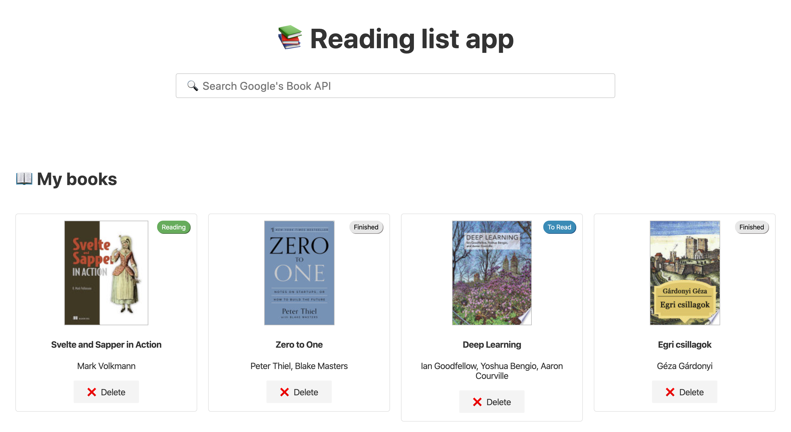

# 📚 Svelte reading list app

This is my first project using Svelte. It's a reading list app using Firestore and Google's Books API.

<kbd>
  
</kbd>

If you have any feedback, hit me up on Twitter: [@alexandraabbas](https://twitter.com/alexandraabbas).

## 🚀 Get started

If you'd like to run this app locally, create a `.env` file in the root folder with the following necessary variables:

- `FIREBASE_API_KEY`
- `FIREBASE_AUTH_DOMAIN`
- `FIREBASE_DATABASE_URL`
- `FIREBASE_PROJECT_ID`
- `FIREBASE_BUCKET`
- `FIREBASE_SENDER_ID`
- `FIREBASE_APP_ID`
- `BOOKS_API_KEY`

Your `BOOKS_API_KEY` will probably be the same as your `FIREBASE_API_KEY` is you're using the same Google Cloud project.

For more more information about how to generate your Firabase config object, visit the [Firebase documentation](https://firebase.google.com/docs/web/setup#config-object).

After configuring Firebase, create a Firestore instance and a collection named `books`. Visit the [Cloud Firestore documentation](https://firebase.google.com/docs/firestore/quickstart) for more information.

Install the dependencies...

```bash
cd svelte-reading-app
npm install
```

...then start [Rollup](https://rollupjs.org):

```bash
npm run dev
```

Navigate to [localhost:5000](http://localhost:5000). You should see the app running.

## Building and running in production mode

To create an optimised version of the app:

```bash
npm run build
```

You can run the newly built app with `npm run start`. This uses [sirv](https://github.com/lukeed/sirv), which is included in your package.json's `dependencies` so that the app will work when you deploy to platforms like [Heroku](https://heroku.com).


## Single-page app mode

By default, sirv will only respond to requests that match files in `public`. This is to maximise compatibility with static fileservers, allowing you to deploy your app anywhere.

If you're building a single-page app (SPA) with multiple routes, sirv needs to be able to respond to requests for *any* path. You can make it so by editing the `"start"` command in package.json:

```js
"start": "sirv public --single"
```


## Deploying to the web

### With [now](https://zeit.co/now)

Install `now` if you haven't already:

```bash
npm install -g now
```

Then, from within your project folder:

```bash
cd public
now deploy --name my-project
```

As an alternative, use the [Now desktop client](https://zeit.co/download) and simply drag the unzipped project folder to the taskbar icon.

### With [surge](https://surge.sh/)

Install `surge` if you haven't already:

```bash
npm install -g surge
```

Then, from within your project folder:

```bash
npm run build
surge public my-project.surge.sh
```
